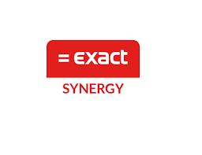

| :warning: Warning |
|:---------------------------|
| This connector is Fit For Purpose built |

| :information_source: Information |
|:---------------------------|
| The 'HelloID-Conn-Prov-Source-Exact-Synergy' connector needs to be executed 'on-premises'. Make sure you have a local 'HelloID provisioning agent' running, and the 'Execute on-premises' switch is toggled on. This connector requires 1 file in the xml format.
This repository contains the connector,configuration code and example import file only. The implementer is responsible to acquire the import file and import folder.

  

## Versioning
| Version | Description | Date |
| - | - | - |
| 1.0.1   | Initial release | 2024/01/29  |

<!-- TABLE OF CONTENTS -->
## Table of Contents
- [Versioning](#versioning)
- [Table of Contents](#table-of-contents)
- [Introduction](#introduction)
- [Getting Started](#getting-started)
  - [Import settings](#import-settings)
  - [Prerequisites](#prerequisites)
  - [Remarks](#remarks)
  - [Mappings](#mappings)
- [Getting help](#getting-help)
- [HelloID docs](#helloid-docs)

## Introduction
This connector requires an import file. An example is provided in this repository. From the Exact Synerg software you can generate an import file in xml format. 

<!-- GETTING STARTED -->
## Getting Started

By using this connector you will have the ability to retrieve employee and contract data from the Exact Synergy using the xml import file.

### Import settings

The following settings are required to import.

| Setting         | Description                                   | Mandatory   |
| --------------- | --------------------------------------------- | ----------- |
| Folderpath      | Path to the file                              | Yes         |
| Filename        | Name of the file                              | Yes         |

### Prerequisites

- [ ] HelloID Provisioning agent (on-prem).
- [ ] xml import file.
- [ ] import folder.
  

### Remarks
 

### Mappings
A basic mapping is provided. Make sure to further customize these accordingly.
Please choose the default mappingset to use with the configured configuration.

## Getting help
> _For more information on how to configure a HelloID PowerShell connector, please refer to our [documentation](https://docs.helloid.com/hc/en-us/articles/360012558020-Configure-a-custom-PowerShell-target-system) pages_

> _If you need help, feel free to ask questions on our [forum](https://forum.helloid.com)_

## HelloID docs
The official HelloID documentation can be found at: https://docs.helloid.com/
